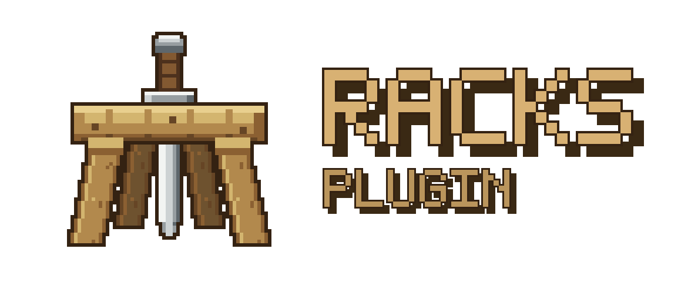
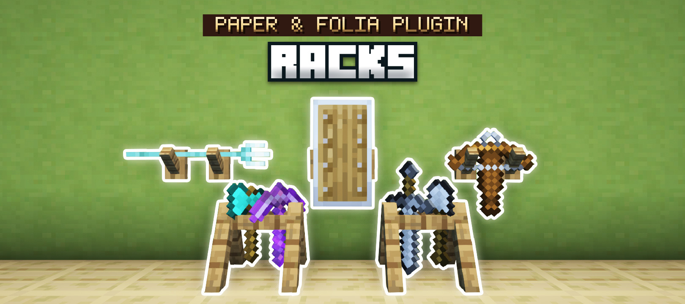
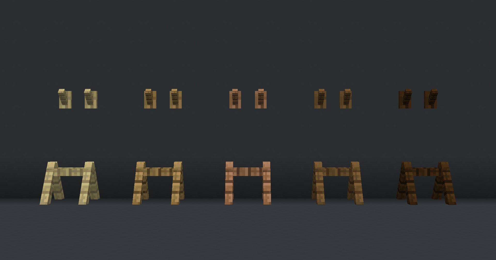
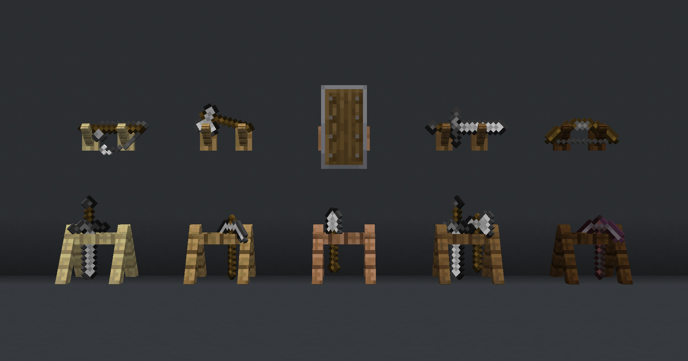
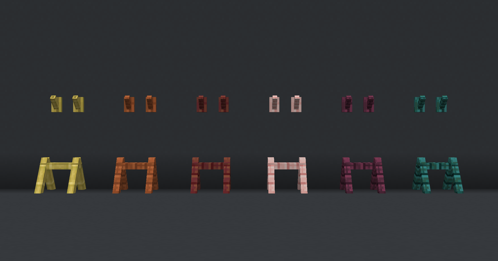
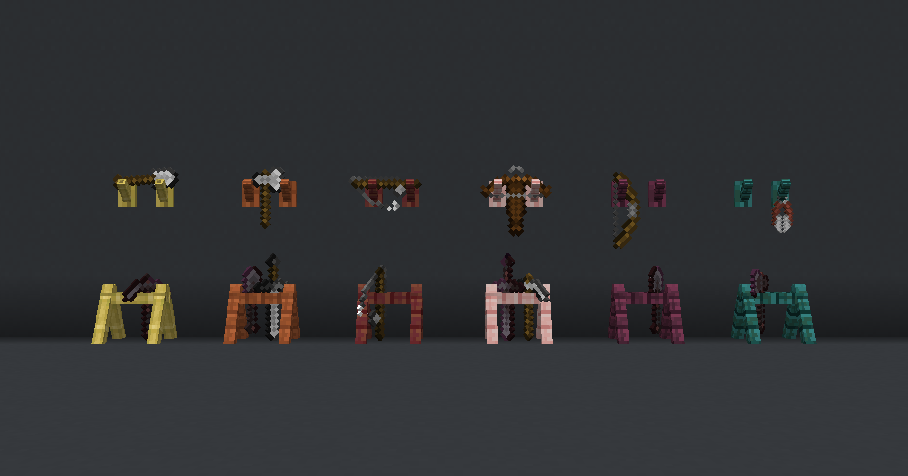
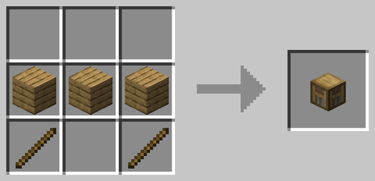

<div align="center">



**Show off your tools.**
Your tools and weapons no longer have to envy the armor stands.
Give them a display of their own, on the floor or on the wall.

A Paper and Folia plugin port of **[Racks](https://modrinth.com/datapack/racks)**, the Minecraft data
pack by **KawaMood**.

[Documentation](https://openvdra.github.io/RacksPlugin/) ·
[Original data pack](https://modrinth.com/datapack/racks) ·
[Changelog](CHANGELOG.md)

</div>



---

Craft a wooden rack, put it on the floor or hang it on a wall, and display your gear on it.
Right-click to swap an item in or out, sneak and right-click to change how the items are angled,
left-click to take the rack back down.

Everything a player sees is the data pack's: the same head item, the same recipe, racks built from
the same display entities at the same offsets, the same poses, the same rules about what a rack will
hold. What changed is underneath. Racks are stored in SQLite, and each item on a rack is saved with
Paper's own serializer, so a rack can hold anything a player can carry and keep it intact across a
Minecraft version upgrade.

- **Minecraft:** 1.21.11
- **Server:** Paper (and forks) or Folia
- **Java:** 21

## Features

| | |
|---|---|
| **12 wood variants** | Oak, spruce, birch, jungle, acacia, dark oak, mangrove, cherry, pale oak, bamboo, crimson, warped |
| **Floor and wall racks** | Two slots on the floor, one on a wall, each with its own frame and click areas |
| **Poses** | Six arrangements on the floor, four on a wall, cycled with sneak + right-click |
| **SQLite storage** | Placed racks and their contents live in `plugins/Racks/racks.db` |
| **Per-player language** | English and Vietnamese included; each player reads their own client language |
| **Folia support** | A rack is only ever touched from the thread that owns its block |
| **Data pack migration** | Racks left standing by the original data pack are imported automatically |

<table>
<tr>
<td width="50%"></td>
<td width="50%"></td>
</tr>
<tr>
<td width="50%"></td>
<td width="50%"></td>
</tr>
</table>

### What a rack will hold

Floor racks take axes, hoes, pickaxes, shovels, spears, swords, maces, carrots on a stick, warped
fungus on a stick and fishing rods. Wall racks take all of those plus bows, crossbows, tridents,
shields, shears and spyglasses. Holding anything else and right-clicking does nothing at all, exactly
as in the data pack.

## Installing

1. Drop `Racks-<version>.jar` into `plugins/`.
2. **Remove the Racks data pack first** if you were using it. See [Migrating](#migrating-from-the-data-pack).
3. Start the server.

No resource pack is required. The rack item is a player head with a custom skin and the rack itself
is built from vanilla fences and buttons, so it looks right on a vanilla client. The item still
carries the data pack's `custom_model_data` strings, so an existing Racks resource pack keeps working
if you have one.

## Crafting

Three planks in a row, two sticks below the ends. Any of the twelve woods works.



## Commands

| Command | Permission | |
|---|---|---|
| `/racks give <variant> [player] [count]` | `racks.command.give` | Hand out a rack |
| `/racks reload` | `racks.command.reload` | Re-read `config.yml` and the language files |
| `/racks setting ignore-wall-rack-support [true\|false]` | `racks.command.setting` | Read or flip the wall support rule |

`/rack` is an alias.

### Permissions

| Node | Default | |
|---|---|---|
| `racks.use` | `true` | Place racks, swap items, change pose, break them |
| `racks.command.give` | `op` | |
| `racks.command.reload` | `op` | |
| `racks.command.setting` | `op` | |

`racks.use` defaults to true because the data pack gated nothing. Out of the box the plugin behaves
identically. Negate it for a group to restrict racks.

## Configuration

`plugins/Racks/config.yml`:

```yaml
language: en_US
language-auto-detect: true

database:
  file: racks.db

settings:
  ignore-wall-rack-support: false
  wall-support-check-interval: 10
  lootable-delay: 0

adopt-datapack-racks: true
recipes-enabled: true
```

**`ignore-wall-rack-support`** is off by default, matching the data pack: a wall rack drops itself
when the block it hangs on is removed. Turn it on and wall racks stay put with no support, and the
periodic check stops running. `/racks setting` writes this through to disk, so unlike the data pack's
scoreboard toggle it survives a restart.

**`wall-support-check-interval`** is how often, in ticks, hanging racks re-check their support. The
data pack scheduled this every 10 ticks. The plugin runs one task per *chunk that actually holds a
wall rack*, so a server with none schedules nothing.

**`lootable-delay`** is how many ticks a rack must have stood before breaking it drops the rack item.
`0` (the default) always drops. This is for land protection plugins that undo a placement a tick
later: without it a player could place and break a rack in the same breath and walk away with two.
Items already on a rack always drop, whatever this is set to.

**`recipes-enabled`** turns the twelve crafting recipes off, leaving `/racks give` and your own loot
tables.

### Languages

`plugins/Racks/language/en_US/messages.yml` and `vi_VN/messages.yml` ship with the plugin. Add your
own by creating `language/<locale>/messages.yml`. It is picked up on the next `/racks reload`, no
plugin update needed.

With `language-auto-detect: true` each player sees messages in their own client language, falling
back to `language:` and then to `en_US`. Set it to `false` to put everyone on one language, which is
how the data pack behaved.

> [!NOTE]
> Item names are baked into the item rather than re-rendered per viewer, so a rack is named in the
> language of whoever received it. On a mixed-language server that means racks named in different
> languages will not stack with each other. Set `language-auto-detect: false` if you would rather they
> always did.

## Migrating from the data pack

> [!WARNING]
> **Remove the data pack before starting the server with this plugin.** If both are installed they
> will fight over the same entities.

With `adopt-datapack-racks: true` (the default) the plugin imports racks the data pack left standing.
It reads each one off the entities that make it up: the wood from the block its frame displays, the
direction from the yaw those displays were turned to, the contents from what the item displays are
holding, and even the pose, by matching the display's transform against the same tables the data pack
applied. The old entities are then removed and a plugin-owned rack is built in their place, holding
the same items in the same pose.

This happens per chunk, as chunks load, so a large world migrates gradually rather than all at once.

Two things cannot be recovered, because they lived only in the data pack's command storage, which has
no API:

- **The recorded owner** is lost. The data pack stored it but never used it, and neither does this
  plugin.
- **The creation time** becomes 0, meaning "old enough to drop", the same way the data pack treated
  racks placed before its own 3.0.0.

Rack items already in players' inventories keep working with no migration at all; they are recognised
by the `custom_model_data` string that has been on every version of the item. They are quietly
re-stamped into the plugin's own form the next time their owner logs in, which is what gives them a
name in the player's language instead of the data pack's fixed English.

Coming from Racks V.2? Run the V.3 data pack's `from_v2` upgrade first. The plugin can only read V.3
racks.

## Deliberate differences from the data pack

Everything else is intentionally identical. These three are not:

1. **Interaction sounds are played at the rack.** The data pack's `/playsound` for swapping and posing
   was given no position, so every player on the server heard it wherever they were standing. Here the
   sound comes from the rack.
2. **Breaking the barrier breaks the rack.** A floor rack stands on a barrier, which only creative
   mode can break. The data pack left the rack's entities behind when that happened, stranding a rack
   that no longer existed as far as anything was concerned. Here that break is treated as breaking
   the rack.
3. **The wall support setting persists.** The data pack kept it in a scoreboard value that reset;
   `/racks setting` writes it to `config.yml`.

## Building

```bash
./gradlew build
```

The shaded jar lands in `build/libs/Racks-<version>.jar`. HikariCP is the only bundled dependency and
it is relocated under `com.racks.libs`; the SQLite driver comes from Paper's own classpath.

```bash
./gradlew runServer
```

starts a Paper 1.21.11 test server with the plugin installed.

### Documentation site

```bash
cd docs
npm install
npm run docs:dev
```

The artwork in `docs/public/` is generated from the data pack's icon by
`docs/scripts/generate-logo.py`, which scales it without blurring and draws the lettering a pixel at
a time so it matches:

```bash
python docs/scripts/generate-logo.py
```

## Credits

The original **[Racks](https://modrinth.com/datapack/racks)** data pack is by **KawaMood**:
[Modrinth](https://modrinth.com/user/KawaMood) ·
[YouTube](https://www.youtube.com/@KawaMood) ·
[Discord](https://discord.com/invite/w8s9XWgN6v) ·
[kawamood.com](https://www.kawamood.com)

The rack designs, item textures, display transformations, poses and the screenshots on this page are
KawaMood's work, used under the terms of the original license.

Plugin port by **Nighter**.

## License

[CC BY-NC-SA 4.0](https://creativecommons.org/licenses/by-nc-sa/4.0/), the same license as the
original data pack. See [LICENSE](LICENSE).
